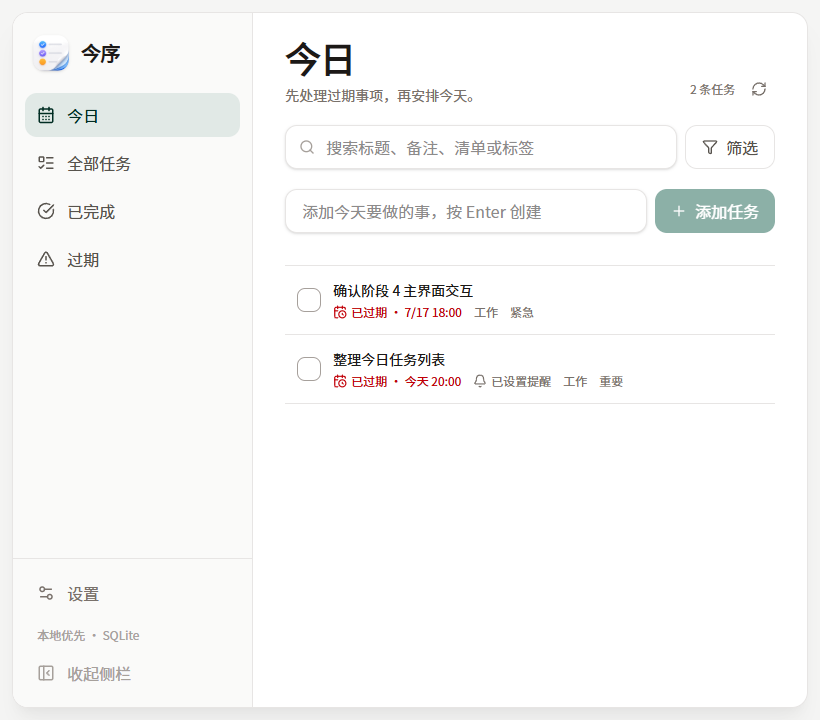

<div align="center">
  

  <h1>今序 · Torder</h1>

  <p><strong>把今天排好，让事情自然向前。</strong></p>
  <p>一款本地优先、轻量克制的 Windows 桌面待办应用。</p>

  <p>
    
    
    
    
    
    
  </p>
</div>

<br />

<div align="center">
  
</div>

<br />

> **✦ 安静、迅速、本地。** 今序不要求登录，不把任务上传到云端，也不试图用复杂功能打断你。打开、记录、完成，然后继续生活。

## ◈ 为什么是今序

|  | 设计取向 | 体验 |
| --- | --- | --- |
| **◇ 本地优先** | SQLite 单机存储 | 数据掌握在自己手中 |
| **◇ 快速捕捉** | 窄窗口与快捷输入 | 想法出现时立即记下 |
| **◇ 克制整理** | 清单、标签与组合筛选 | 足够有序，但不过度管理 |
| **◇ 桌面常驻** | 托盘、提醒与快捷键 | 需要时出现，不需要时安静 |
| **◇ 可迁移** | 完整 JSON 导入导出 | 备份和恢复不依赖服务端 |

## ✦ 核心能力

### 任务管理

- 创建、编辑、完成、删除任务
- 今日、全部、已完成、过期智能视图
- 截止时间、提醒时间、优先级与备注
- 默认提醒提前量与应用运行期提醒

### 整理与检索

- 标题、备注、清单和标签关键词搜索
- 日期、优先级、清单、标签组合筛选
- 标签创建、编辑、删除与任务关联
- 清晰的空状态和 1000 条任务查询验证

### 桌面体验

- 默认紧凑窗口，可自由拉宽
- 桌面侧栏可展开或收起
- 浅色、深色、跟随系统主题
- 关闭窗口后驻留托盘
- 托盘打开、快速新建和退出
- Windows 开机自动启动

## ⌘ 快捷键

| 快捷键 | 操作 |
| --- | --- |
| `Ctrl + N` | 聚焦快速创建 |
| `Ctrl + F` | 聚焦任务搜索 |
| `Ctrl + ,` | 打开设置 |
| `Esc` | 关闭详情、弹层或当前提醒 |

## ◇ 技术栈

| 层级 | 技术 |
| --- | --- |
| 桌面容器 | Tauri 2 |
| 前端 | React 19 · TypeScript · Vite |
| 状态管理 | Zustand |
| 样式 | Tailwind CSS 4 |
| 组件与图标 | Radix UI · Lucide React |
| 本地能力 | Rust · SQLite · rusqlite |
| 桌面插件 | Notification · Dialog · Autostart · Opener |
| 包管理 | **pnpm only** |

## ⌁ 项目结构

```text
Torder/
├─ src/                     # React 前端
│  ├─ app/                 # 应用编排、主题、视图规则
│  ├─ components/          # 布局、任务、设置、提醒组件
│  ├─ services/            # Tauri IPC 与浏览器预览服务
│  └─ stores/              # Zustand 状态
├─ src-tauri/
│  ├─ src/                 # Rust 命令、Repository、托盘能力
│  ├─ icons/               # 桌面与安装包图标
│  └─ capabilities/        # Tauri 权限配置
├─ docs/                   # 需求、技术方案与阶段验证记录
└─ output/playwright/      # UI 验证截图
```

## → 本地开发

### 环境要求

- Windows 10 / 11
- Node.js 20.19+ 或 22.12+
- pnpm
- Rust stable
- Visual Studio Build Tools（Desktop development with C++）
- WebView2 Runtime

### 启动桌面应用

```powershell
pnpm install
pnpm tauri dev
```

### 质量检查

```powershell
pnpm format:check
pnpm lint
pnpm build
cargo check --manifest-path src-tauri/Cargo.toml
cargo test --manifest-path src-tauri/Cargo.toml
```

### 生成安装包

```powershell
pnpm tauri build
```

> 项目统一使用 **pnpm**，不使用 npm 执行依赖安装或项目脚本。

## ⛁ 数据与隐私

今序的任务数据默认保存在当前 Windows 用户目录：

```text
%APPDATA%\com.zhaxideler.torder\torder.sqlite
```

- 任务内容不会上传到远程服务器
- 可以随时导出完整 JSON 备份
- 导入操作先校验，再在事务中整体恢复
- 导入失败不会破坏现有数据

## ◌ 当前状态

- 当前版本：`0.1.0`
- 已完成：核心任务、搜索筛选、标签、设置、主题、导入导出、提醒、托盘与快捷键
- 下一阶段：完整回归测试、Windows 安装包、安装/卸载验证与发布候选

提醒能力目前优先保证**应用运行期间**稳定。Windows 系统 Toast 的安装态可见性会在发布候选安装包中完成最终验收。

## ✧ 文档

- [产品需求简表](./docs/Torder（今序）产品需求简表.md)
- [MVP 功能清单](./docs/Torder（今序）MVP功能清单.md)
- [技术方案书](./docs/Torder（今序）技术方案书.md)
- [分阶段开发方案书](./docs/Torder（今序）分阶段开发方案书.md)

---

<div align="center">
  <strong>今序</strong><br />
  <sub>Local tasks. Clear mind.</sub>
</div>
