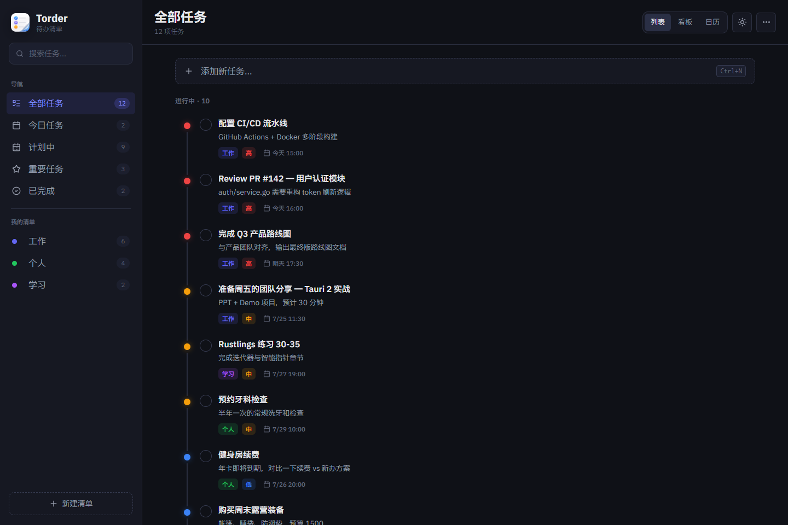

<div align="center">
  

  <h1>今序 · Torder</h1>

  <p><strong>把今天排好，让事情自然向前。</strong></p>
  <p>本地优先、暗色优先、轻量克制的 Windows 桌面待办应用。</p>

  <p>
    
    
    
    
    
    
  </p>
</div>

<br />

<p align="center">
  
</p>

<br />

> 🌙 今序是一款安静的任务工作台。左侧整理入口，中间专注执行，右侧查看细节；不要求登录，不把任务上传到云端，也不试图用复杂功能打断你。

## ✨ 产品定位

| 特点 | 说明 |
| --- | --- |
| 🔐 本地优先 | 任务数据默认保存在本机 SQLite 数据库中 |
| 🌙 暗色优先 | 默认视觉适合长时间停留，信息密度克制 |
| 🧭 清晰导航 | 侧栏聚合搜索、系统视图、我的清单和新建清单入口 |
| ✅ 专注闭环 | 从创建、查看、编辑到完成，围绕任务本身展开 |
| 🖥️ 桌面常驻 | 支持 Tauri 托盘，随时回到任务工作台 |

## 🧩 核心能力

### 📝 任务管理

- 创建、编辑、完成、删除任务
- 任务标题、描述、优先级、所属清单、截止日期与具体时间
- 截止时间展示具体时刻，并提供今天、明天、逾期等辅助文案
- 右侧详情面板常驻展示选中任务，支持只读与编辑状态切换

### 🧭 视图与清单

- 系统视图：全部、今天、计划中、重要、已完成
- 默认清单：工作、个人、学习
- 支持创建自定义清单
- 侧栏 badge 展示各视图和清单的任务数量

### 🗂️ 多布局工作台

- 列表视图：时间线式任务列表，适合日常处理
- 看板视图：按待处理、进行中、已完成分列
- 日历视图：按截止日期分组，无日期任务进入未安排

### ⚡ 操作体验

- `Ctrl + N` 打开新建任务弹窗
- `?` 打开快捷键面板
- `B` 切换批量选择模式
- `Esc` 关闭弹窗、菜单、快捷键面板或退出编辑状态
- 更多菜单支持排序和显示/隐藏已完成

## 🛠️ 技术栈

| 层级 | 技术 |
| --- | --- |
| 桌面容器 | Tauri 2 |
| 前端 | React 19 · TypeScript · Vite |
| 状态管理 | Zustand |
| 样式 | Tailwind CSS 4 |
| 图标 | Lucide React |
| 本地能力 | Rust · SQLite · rusqlite |
| 桌面能力 | Tauri Tray · Window Vibrancy |
| 包管理 | pnpm only |

## 📁 项目结构

```text
Torder/
├─ src/                     # React 前端
│  ├─ app/                 # 应用编排、日期和视图规则
│  ├─ services/            # Tauri IPC 与浏览器预览服务
│  ├─ stores/              # Zustand 状态
│  └─ styles/              # 全局样式和设计令牌
├─ src-tauri/
│  ├─ src/                 # Rust 命令、Repository、数据库迁移、托盘能力
│  ├─ icons/               # 桌面与安装包图标
│  └─ capabilities/        # Tauri 权限配置
└─ output/playwright/      # UI 回归截图
```

## 🚀 本地开发

### 环境要求

- Windows 10 / 11
- Node.js 20.19+ 或 22.12+
- pnpm
- Rust stable
- Visual Studio Build Tools，需包含 Desktop development with C++
- WebView2 Runtime

### 启动开发环境

```powershell
pnpm install
pnpm tauri dev
```

### 质量检查

```powershell
pnpm lint
pnpm build
cargo +stable-x86_64-pc-windows-msvc test --manifest-path src-tauri/Cargo.toml
```

### Windows 打包

```powershell
$env:Path = 'D:\cargo\bin;' + $env:Path
$env:RUSTUP_TOOLCHAIN = 'stable-x86_64-pc-windows-msvc'
$env:CARGO_BUILD_JOBS = '4'
pnpm tauri build
```

执行完成后会生成 Windows NSIS 安装包。

## 🔐 数据与隐私

今序默认把任务数据保存在当前 Windows 用户目录：

```text
%APPDATA%\com.zhaxideler.torder\torder.sqlite
```

- 任务数据本地存储，不上传到远程服务器
- 应用不要求登录，不绑定账号体系
- 如需手动迁移数据，请先备份上面的 SQLite 数据库文件

---

<div align="center">
  <strong>今序</strong><br />
  <sub>Local tasks. Clear mind.</sub>
</div>
