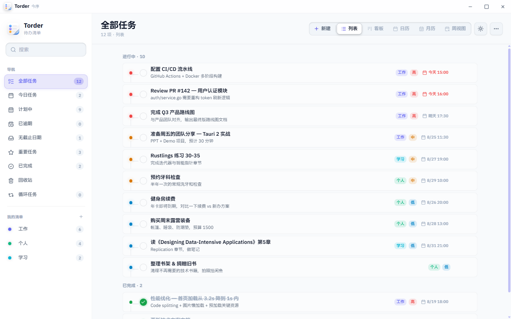

# Torder

Torder（今序）是一款本地优先的桌面待办工作台，面向日常任务管理、清单整理、计划安排和提醒场景。应用默认将数据保存在本机 SQLite 数据库中，同时提供 WebDAV 同步能力，适合希望拥有清晰界面、低打扰体验和可控数据归属的用户。



## 功能特性

- 任务管理：支持标题、描述、截止时间、提醒、优先级、所属清单、完成状态等字段。
- 多视图呈现：提供列表、看板、日历、月历和周视图，适配不同任务浏览方式。
- 清单组织：支持系统视图、自定义清单、重要任务、循环任务、回收站等分类。
- 循环任务：支持按天、周、月、季度等周期生成后续任务。
- 本地存储：使用 SQLite 持久化数据，支持自动迁移和本地备份恢复。
- 数据同步：支持 WebDAV 同步，便于在多端之间同步任务数据。
- 桌面体验：支持系统托盘、无边框窗口、深浅色主题和提醒通知。
- 数据导出：支持 JSON、Markdown、CSV 等格式导出，方便迁移和二次处理。

## 关键技术

- React 19：构建前端交互界面。
- TypeScript：提供严格类型约束。
- Vite 7：负责前端开发与构建。
- Zustand：管理应用状态。
- Tauri 2：提供轻量桌面容器与系统能力。
- Rust：实现桌面端命令、数据层、同步和后台任务。
- SQLite / rusqlite：负责本地数据持久化。
- WebDAV：用于跨设备同步数据。
- Tailwind CSS 4 + CSS Variables：管理样式系统和主题变量。

## 本地开发

推荐使用 `pnpm`。

```powershell
pnpm install
pnpm dev
```

启动完整桌面应用：

```powershell
pnpm tauri dev
```

常用检查：

```powershell
pnpm lint
pnpm build
```

Rust 测试：

```powershell
Set-Location src-tauri
cargo +stable-x86_64-pc-windows-msvc test
```

## 打包

Windows 安装包：

```powershell
$env:CARGO_BUILD_JOBS = "4"
pnpm tauri build
```

Android 安装包：

```powershell
pnpm tauri android build --apk
```

## 反馈

欢迎提交 Issue 或 Pull Request。也可以通过邮箱联系我：

- Email: zhaxideler@163.com

## License

This project is licensed under the MIT License. See [LICENSE](./LICENSE) for details.
