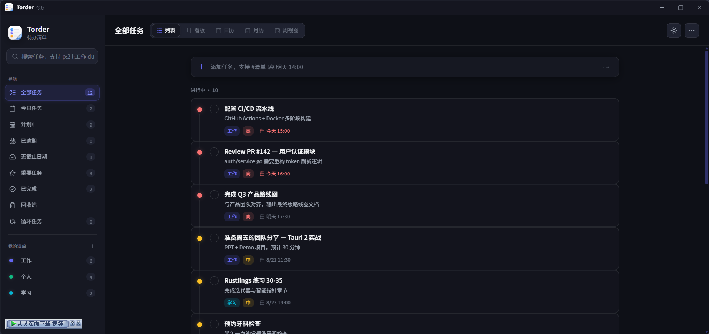
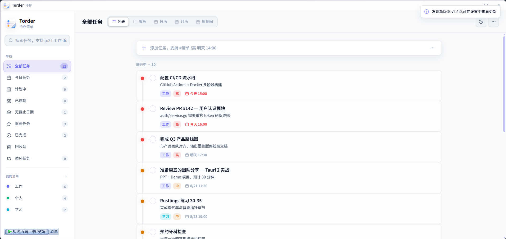

<div align="center">
  

  <h1>今序 · Torder</h1>

  <p><strong>把今天排好，让事情自然向前。</strong></p>
  <p>✨ 本地优先 · 暗色优先 · 极致精修的 Windows 桌面待办工作台 ✨</p>

  <p>
    
    
    
    
    
    
  </p>
</div>

<br />

<p align="center">
   
</p>

<br />

> 🌙 **今序** 是一款安静、极简而精致的任务工作台。左侧清晰导航，中间专注执行，右侧查看细节；无需登录，不上传云端，无打扰，纯粹专注。

---

## 💎 产品亮点

| 维度 | 特性与设计理念 |
| :--- | :--- |
| 🔐 **本地优先** | 数据全量保存在本机 SQLite 数据库，隐私完全归属于你 |
| 🎨 **极致精修 UI** | 沉浸暗色设计、动态下拉展开输入框、毛玻璃 (`backdrop-filter`) 下拉菜单 |
| 🧭 **分段胶囊 Tab** | 现代 Segments 控制条，无缝切换列表、看板、日历三布局 |
| ⚡ **极速桌面体验** | 基于 Rust + Tauri 2 驱动，极低资源占用，支持托盘常驻 |
| 🎯 **高效交互** | 智能全局 Outside 点击自动收起、支持多级快捷键高效流转 |

---

## 🧩 核心能力

### 📝 动态折叠/展开新建任务
- **极简折叠态**：默认展示低高度单行输入框，专注录入，干净无冗余。
- **平滑下拉动画**：点击/聚焦时平滑拉伸，展开截止时间、优先级（高/中/低多彩发光芯片）、清单分类三大属性。

### 🗂️ 三大视图与清单导航
- 📋 **列表视图**：时间线式任务呈现，适合日常处理与快速扫视。
- 📊 **看板视图**：按待处理、进行中、已完成直观分列拖拽视角。
- 📅 **日历视图**：按截止日期时间轴展示，一目了然。

### ⚙️ 快捷键与高质细节
- `Enter` 快速录入事项
- `Ctrl + N` 打开高级新建表单
- `B` 切换批量操作模式
- `?` 开启快捷键面板
- `Esc` 一键关闭弹窗/离开编辑态

---

## 🛠️ 技术架构

```text
今序 (Torder)
├─ 前端应用 (React 19 + TypeScript + Vite + Zustand + Tailwind CSS 4)
│  ├─ 界面精修：Segmented Control 胶囊切态、毛玻璃 Dropdown、动态展开输入框
│  └─ 状态流转：Zustand 本地状态与视图模式同步
└─ 桌面容器 (Tauri v2 + Rust + SQLite)
   ├─ 数据持久化：rusqlite + 自动 Schema 迁移
   └─ 桌面能力：系统托盘 (Tray)、Win11 Vibrancy 视觉效果
```

---

## 🚀 本地开发

### 1. 环境准备
- Node.js 20.19+ / 22.12+ & `pnpm`
- Rust Stable Toolchain

### 2. 开发启动
```powershell
pnpm install
pnpm tauri dev
```

---

## 🔐 隐私与数据安全

今序默认将任务数据存储于本机 Windows 用户目录：

```text
%APPDATA%\com.zhaxideler.torder\torder.sqlite
```

- 彻底摆脱网络依赖与云端泄露风险。
- 如需迁移或备份，只需复制该 `.sqlite` 数据库文件即可。

---

<div align="center">
  <strong>今序 · Torder</strong><br />
  <sub>Local tasks. Clear mind. Pure focus.</sub>
</div>
