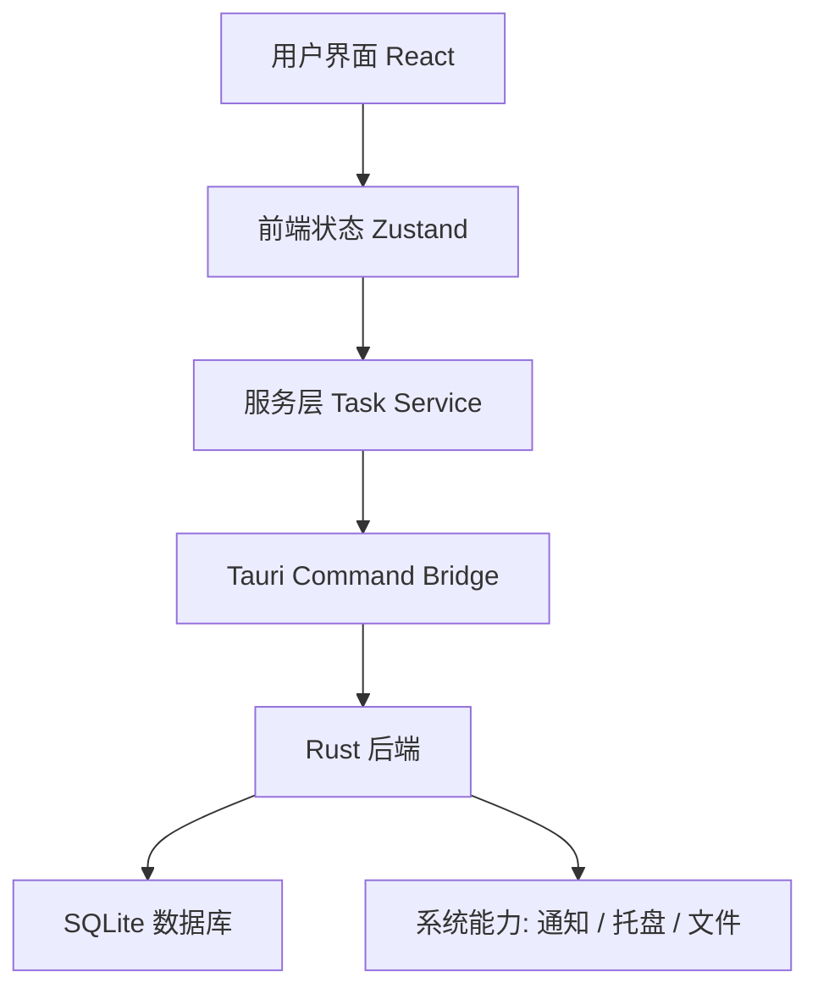

# Torder（今序）电脑待办事项软件技术方案书

## 1. 文档信息

- 产品英文名：Torder
- 产品中文名：今序
- 产品显示名：Torder（今序）
- 产品类型：桌面端待办事项与日常任务管理软件
- 首发平台：Windows
- 推荐形态：本地优先的轻量桌面应用
- 文档版本：V1.0
- 编写日期：2026-07-18
- 包管理器：统一使用 pnpm，不使用 npm

## 2. 项目摘要

Torder（今序）是一款面向个人日常事务管理的电脑桌面待办软件。产品核心目标是让用户以最快速度记录任务、整理今日安排、追踪完成状态，并通过简洁美观的界面降低日常任务管理的压力。

产品不追求复杂项目管理，也不在 MVP 阶段引入团队协作、账号系统、云同步等重功能。第一版应优先做到：

- 打开快
- 记录快
- 查找快
- 状态清晰
- 数据可靠保存在本地
- 界面简洁耐看

推荐技术方案为：

- 桌面框架：Tauri 2
- 前端框架：React
- 开发语言：TypeScript
- 构建工具：Vite
- 本地数据库：SQLite
- 状态管理：Zustand
- 样式方案：Tailwind CSS
- 组件基础：shadcn/ui 或 Radix UI
- 图标库：lucide-react
- 单元测试：Vitest
- 端到端测试：Playwright

## 3. 产品定位

### 3.1 一句话定位

Torder（今序）是一款轻量、快速、简洁、美观的电脑端个人待办事项软件，用于记录和处理日常任务。

### 3.2 目标用户

- 经常在电脑前工作、学习、处理生活事项的人
- 需要快速记录零散事项的人
- 不想使用复杂项目管理软件的人
- 更偏好本地数据、轻量工具、简洁界面的用户
- 需要每日整理任务、提醒和归档的人

### 3.3 核心价值

- 低打扰：记录事项不打断当前工作流
- 高确定：今日事项、待处理事项、已完成事项一眼清楚
- 本地优先：数据主要保存在用户电脑上，减少账号和网络依赖
- 小而美：不堆功能，优先把常用流程做顺

## 4. MVP 功能范围

### 4.1 必做功能

1. 任务创建
   - 输入标题快速创建任务
   - 支持备注
   - 支持截止日期
   - 支持优先级
   - 支持任务状态

2. 任务列表
   - 今日任务
   - 全部未完成任务
   - 已完成任务
   - 过期任务

3. 任务操作
   - 标记完成
   - 取消完成
   - 编辑任务
   - 删除任务

4. 分类组织
   - 项目或清单
   - 标签
   - 优先级

5. 搜索和筛选
   - 按关键词搜索
   - 按状态筛选
   - 按日期筛选
   - 按标签筛选

6. 本地持久化
   - SQLite 保存任务数据
   - 应用重启后数据完整恢复

7. 设置
   - 主题切换
   - 数据导出
   - 数据导入
   - 开机启动可选

8. 基础提醒
   - 到期提醒
   - 系统通知
   - 提醒时间可设置

9. 基础托盘
   - 打开主窗口
   - 退出应用

### 4.2 首版可选功能

- 托盘快速添加和今日任务数量
- 全局快捷键快速添加
- 任务拖拽排序
- 简单重复任务
- Markdown 备注预览
- 日历视图

### 4.3 暂不做功能

- 账号系统
- 多端云同步
- 团队协作
- 甘特图
- 看板式复杂项目管理
- 插件市场
- AI 自动规划
- 复杂统计报表

这些功能不是不好，而是第一版会拖慢节奏。Torder（今序）要先把个人本地待办体验打磨顺。

## 5. 技术栈推荐

### 5.1 总体推荐

| 模块 | 推荐技术 | 选择原因 |
| --- | --- | --- |
| 桌面容器 | Tauri 2 | 体积小、性能好、适合轻量桌面工具 |
| 前端框架 | React | 生态成熟、开发速度快、组件化清晰 |
| 开发语言 | TypeScript | 类型安全，适合维护数据模型和交互状态 |
| 构建工具 | Vite | 启动快，开发体验好 |
| 本地数据库 | SQLite | 稳定、轻量、适合本地任务数据 |
| 状态管理 | Zustand | API 简洁，适合中小型应用 |
| 样式 | Tailwind CSS | 开发快，视觉统一，便于响应式处理 |
| UI 基础 | shadcn/ui 或 Radix UI | 可控、可定制、无障碍基础较好 |
| 图标 | lucide-react | 风格统一，适合工具类软件 |
| 单元测试 | Vitest | 与 Vite 生态配合好 |
| E2E 测试 | Playwright | 可验证关键桌面 Web UI 流程 |
| 打包发布 | Tauri Bundler | 可生成 Windows 安装包 |

### 5.2 为什么推荐 Tauri

Tauri 适合 Torder（今序）的原因：

- 安装包体积通常小于 Electron
- 内存占用更友好
- 使用系统 WebView，适合轻量桌面工具
- Rust 后端可负责本地数据库、文件、通知等能力
- 安全边界比传统 Web 桌面壳更清晰

对 Torder（今序）这种本地优先、轻量、追求速度的产品来说，Tauri 比 Electron 更符合方向。

### 5.3 为什么不优先选 Electron

Electron 的优势是生态成熟、能力强、坑少，但缺点也明显：

- 安装包偏大
- 内存占用偏高
- 对一个轻量待办软件来说略重

如果未来需要更复杂的跨平台能力、浏览器级插件体系、或团队已有 Electron 经验，也可以考虑 Electron。但当前目标是速度、简洁、美观，所以推荐 Tauri。

### 5.4 为什么选 SQLite

SQLite 适合本地待办事项的原因：

- 无需用户安装数据库服务
- 文件级存储，备份迁移方便
- 查询能力比纯 JSON 文件更可靠
- 支持索引、事务、迁移
- 适合搜索、筛选、统计等场景

第一版可以用 SQLite 直接落地，不建议先用 LocalStorage。LocalStorage 虽快，但后续迁移、查询、可靠性都不如 SQLite。

## 6. 系统架构

### 6.1 架构分层



### 6.2 前端职责

- 页面布局
- 任务输入与编辑
- 列表渲染
- 过滤和排序状态
- 主题状态
- 键盘快捷操作
- 与 Tauri 后端通信

### 6.3 后端职责

- SQLite 初始化
- 数据库迁移
- 任务增删改查
- 导入导出文件
- 系统通知
- 托盘菜单
- 全局快捷键
- 本地配置读取和写入

### 6.4 数据流

1. 用户在界面创建任务
2. React 组件调用前端 Task Service
3. Task Service 调用 Tauri command
4. Rust 后端写入 SQLite
5. 写入成功后返回任务数据
6. Zustand 更新前端状态
7. UI 自动刷新任务列表

## 7. 核心数据模型

### 7.1 tasks 表

| 字段 | 类型 | 说明 |
| --- | --- | --- |
| id | TEXT | 任务 ID，建议使用 UUID |
| title | TEXT | 任务标题 |
| note | TEXT | 任务备注，可为空 |
| status | TEXT | todo、done、archived |
| priority | INTEGER | 优先级，0 普通，1 重要，2 紧急 |
| list_id | TEXT | 所属清单 ID |
| due_at | TEXT | 截止时间，ISO 字符串 |
| remind_at | TEXT | 提醒时间，ISO 字符串 |
| completed_at | TEXT | 完成时间 |
| sort_order | INTEGER | 手动排序 |
| created_at | TEXT | 创建时间 |
| updated_at | TEXT | 更新时间 |
| deleted_at | TEXT | 软删除时间 |

### 7.2 lists 表

| 字段 | 类型 | 说明 |
| --- | --- | --- |
| id | TEXT | 清单 ID |
| name | TEXT | 清单名称 |
| color | TEXT | 清单颜色 |
| sort_order | INTEGER | 排序 |
| created_at | TEXT | 创建时间 |
| updated_at | TEXT | 更新时间 |

### 7.3 tags 表

| 字段 | 类型 | 说明 |
| --- | --- | --- |
| id | TEXT | 标签 ID |
| name | TEXT | 标签名 |
| color | TEXT | 标签颜色 |
| created_at | TEXT | 创建时间 |

### 7.4 task_tags 表

| 字段 | 类型 | 说明 |
| --- | --- | --- |
| task_id | TEXT | 任务 ID |
| tag_id | TEXT | 标签 ID |

### 7.5 settings 表

| 字段 | 类型 | 说明 |
| --- | --- | --- |
| key | TEXT | 设置项 |
| value | TEXT | 设置值，JSON 字符串 |
| updated_at | TEXT | 更新时间 |

## 8. 主要功能设计

### 8.1 快速添加任务

用户打开应用后，输入框应处于主要视觉位置。输入标题后按 Enter 即可创建任务。

建议支持基础自然输入，但第一版不做复杂自然语言解析。例如：

- 输入 `下午 3 点开会`
- 第一版只当作普通标题
- 后续版本再识别日期和提醒

第一版重点是录入快，不把解析能力作为阻塞。

### 8.2 今日视图

今日视图是主入口，展示：

- 今天到期任务
- 已过期未完成任务
- 可选显示今日已完成任务

无截止时间的任务不会因为创建于今天自动进入今日视图；在今日视图快速创建的任务默认截止到本地当天结束。

排序建议：

1. 过期未完成
2. 今天到期
3. 有提醒时间
4. 高优先级
5. 手动排序
6. 创建时间

### 8.3 全部任务

全部任务用于查找和整理，不作为首屏主要负担。

应支持：

- 按清单分组
- 按状态筛选
- 按优先级筛选
- 按标签筛选
- 按关键词搜索

### 8.4 任务详情

任务详情可以采用右侧抽屉或弹窗。

包含：

- 标题
- 备注
- 状态
- 清单
- 标签
- 截止时间
- 提醒时间
- 优先级
- 创建时间
- 更新时间

推荐第一版使用右侧抽屉，因为它比弹窗更适合连续编辑多个任务。

### 8.5 清单与标签

清单用于稳定分类，标签用于横向标记。

建议默认内置清单：

- 收件箱
- 工作
- 生活

“今天”属于智能视图，不作为用户清单。

标签由用户自由创建。第一版标签功能保持轻量，不做复杂层级。

### 8.6 提醒

提醒能力分两层：

- 应用内提醒：应用运行时检查提醒时间
- 系统通知：调用系统通知能力弹出提醒

第一版建议做到应用运行时提醒即可。若用户关闭应用，提醒不保证触发，这一点在设置页说明即可。

### 8.7 托盘

托盘适合桌面待办软件。

建议提供：

- 打开主窗口
- 快速添加任务
- 今日任务数量
- 退出应用

MVP 可先做打开主窗口和退出应用，快速添加可放到后续阶段。

### 8.8 快捷键

建议快捷键：

| 快捷键 | 动作 |
| --- | --- |
| Ctrl+N | 新建任务 |
| Ctrl+F | 搜索 |
| Ctrl+1 | 今日视图 |
| Ctrl+2 | 全部任务 |
| Ctrl+, | 设置 |
| Enter | 创建或保存 |
| Esc | 关闭详情或取消输入 |

全局快捷键可放在后续版本，例如 `Ctrl+Alt+T` 快速唤起添加窗口。

## 9. 界面方案

### 9.1 总体风格

Torder（今序）的界面应简洁、安静、清楚，不做过度装饰。它是用户每天会打开多次的软件，视觉要耐看。

设计关键词：

- 轻量
- 清爽
- 高对比
- 少打扰
- 信息密度适中
- 操作入口明确

### 9.2 页面布局

建议采用经典三栏结构：

- 左侧栏：视图入口、清单、标签
- 中间区：任务列表
- 右侧区：任务详情，可折叠


### 9.3 首页默认状态

首次打开应用时，应展示今日视图。

首屏包含：

- 顶部快速输入框
- 今日任务列表
- 过期任务提示
- 已完成任务折叠区

### 9.4 视觉建议

- 背景使用浅灰或纯白，避免大面积深色
- 重点按钮使用稳定主色
- 任务完成态降低透明度并加删除线
- 过期任务使用柔和警示色，不要过分刺眼
- 标签用小色块或圆点区分
- 列表项高度稳定，避免内容跳动

### 9.5 主题

第一版建议支持：

- 跟随系统
- 浅色
- 深色

主题实现建议：

- 使用 CSS variables 管理颜色
- Tailwind 读取变量
- 设置写入本地 settings 表

## 10. 本地数据与隐私

Torder（今序）默认不上传用户任务数据。

### 10.1 数据保存位置

建议使用 Tauri 标准应用数据目录：

- Windows：`%APPDATA%/Torder`
- 数据库：`torder.sqlite`
- 配置：优先存数据库 settings 表，必要时补充 config 文件

### 10.2 数据可靠性

应保证：

- 写入任务使用事务
- 删除任务优先软删除
- 支持导出 JSON
- 支持导入 JSON
- 数据库迁移有版本记录

### 10.3 隐私原则

- 不默认收集行为数据
- 不要求登录
- 不上传任务内容
- 不接入第三方统计 SDK

## 11. 目录结构建议

```text
torder/
  package.json
  vite.config.ts
  tsconfig.json
  src/
    app/
      App.tsx
      routes.tsx
    components/
      task/
      layout/
      common/
    services/
      taskService.ts
      settingsService.ts
    stores/
      taskStore.ts
      uiStore.ts
    types/
      task.ts
      settings.ts
    styles/
      globals.css
    test/
  src-tauri/
    Cargo.toml
    tauri.conf.json
    src/
      main.rs
      commands/
        task.rs
        settings.rs
      db/
        mod.rs
        migrations.rs
        task_repository.rs
      tray.rs
      notifications.rs
```

## 12. 开发环境

### 12.1 必需环境

- Node.js LTS
- pnpm
- Rust stable
- Visual Studio Build Tools
- WebView2 Runtime

### 12.2 推荐命令

```powershell
pnpm create tauri-app@latest torder
cd torder
pnpm install
pnpm run tauri dev
```

实际命令以项目脚手架生成后的 `package.json` 为准。

## 13. 测试方案

### 13.1 单元测试

重点覆盖：

- 任务排序规则
- 日期过滤逻辑
- 搜索过滤逻辑
- 状态切换逻辑
- 数据格式转换

工具：

- Vitest
- Testing Library

### 13.2 集成测试

重点覆盖：

- 创建任务后刷新列表
- 编辑任务后数据保存
- 标记完成后进入完成区
- 删除任务后不再显示
- 设置主题后重启仍生效

### 13.3 E2E 测试

重点覆盖：

- 首次启动
- 快速添加任务
- 搜索任务
- 切换视图
- 打开设置
- 导出数据

工具：

- Playwright

### 13.4 手工验收

每次阶段完成后至少检查：

- 应用能启动
- 数据能保存
- 主流程无明显卡顿
- 页面没有文字重叠
- 空状态、加载状态、错误状态可理解

## 14. 性能指标

建议目标：

| 指标 | 目标 |
| --- | --- |
| 冷启动到可见窗口 | 2 秒内 |
| 新建任务响应 | 100 毫秒内 |
| 1000 条任务列表筛选 | 300 毫秒内 |
| 安装包大小 | 尽量控制在 30 MB 内 |
| 常驻内存 | 尽量控制在 150 MB 内 |

这些指标不是硬性承诺，但应作为开发过程中的优化方向。

## 15. 打包与发布

### 15.1 Windows 发布形式

建议第一版提供：

- `.msi` 安装包
- 或 `.exe` 安装包

### 15.2 版本号策略

建议使用语义化版本：

- `0.1.0` 内部可用版本
- `0.5.0` 功能基本完整版本
- `1.0.0` 首个正式版本

### 15.3 发布前检查

- 数据库迁移正常
- 安装后可启动
- 卸载不误删用户数据
- 导入导出功能正常
- 通知权限正常
- 托盘退出正常

## 16. 风险与应对

| 风险 | 表现 | 应对 |
| --- | --- | --- |
| Tauri 环境配置复杂 | Windows 编译失败 | 提前确认 Rust、Build Tools、WebView2 |
| SQLite 迁移遗漏 | 版本升级后数据异常 | 从第一版建立 migrations 机制 |
| 提醒不稳定 | 应用关闭后无法提醒 | MVP 明确只保证运行中提醒 |
| 功能膨胀 | 首版周期拉长 | 严格区分 MVP、V1.1、V2 |
| UI 细节耗时 | 页面迟迟不能收口 | 先确定布局和组件规则，再做局部打磨 |
| 打包体积或构建慢 | 发布效率低 | 使用 Tauri，减少不必要依赖 |

## 17. 推荐开发节奏

建议先用 4 到 6 周做出可用 V1。

大致节奏：

- 第 1 周：需求冻结、原型确认、项目初始化
- 第 2 周：数据库和核心任务接口
- 第 3 周：任务增删改查、主界面
- 第 4 周：搜索筛选、设置、导入导出
- 第 5 周：提醒、托盘、快捷键
- 第 6 周：测试、打包、修复体验问题

若只追求最快可用，可以先压缩为 2 到 3 周，但提醒、托盘、复杂筛选要后置。

## 18. MVP 验收标准

Torder（今序）MVP 完成标准：

- 可以安装并打开 Windows 桌面应用
- 可以创建、编辑、删除、完成任务
- 可以查看今日、全部、已完成、过期任务
- 可以设置截止时间、优先级、清单、标签
- 可以搜索和筛选任务
- 可以本地保存数据，重启后不丢失
- 可以导出和导入数据
- 可以切换主题
- 可以触发基础到期提醒
- 界面简洁美观，无明显布局错乱

## 19. 后续版本方向

### 19.1 V1.1

- 更完善的重复任务
- 全局快捷添加
- 日历视图
- 拖拽排序
- 更细的提醒设置

### 19.2 V1.5

- 多设备同步可选
- 数据加密
- 番茄钟
- 统计视图
- 模板任务

### 19.3 V2.0

- 账号体系
- 云同步
- 移动端
- AI 辅助拆解任务
- 日程系统集成

## 20. 结论

Torder（今序）第一版应坚持轻量、本地、快速、简洁的方向。技术栈推荐 Tauri 2 + React + TypeScript + SQLite，这套方案能兼顾开发效率、桌面体验、安装体积和后续扩展空间。

开发时不要一开始追求全能任务管理平台，而是先把最关键的个人待办闭环做好：

记录任务，整理任务，完成任务，找回任务，提醒任务。

只要这个闭环足够顺，Torder（今序）就能成为一款真正日常可用的小工具。
